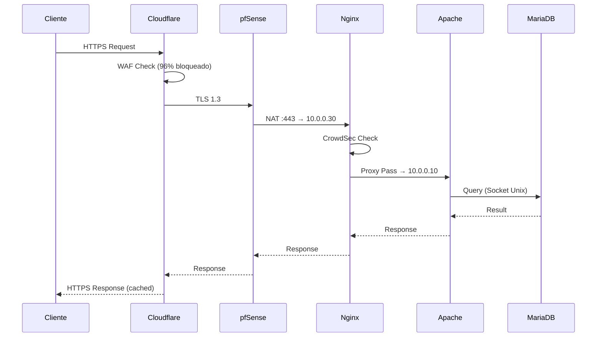

# 🌐 Infraestrutura de Produção

O BabeStand está integrado na infraestrutura fsociety.pt, numa arquitetura de rede segmentada com múltiplas camadas de proteção.

## Arquitetura de Rede

```
┌─────────────────────────────────────────────────────────────┐
│                        INTERNET                             │
└─────────────────────────┬───────────────────────────────────┘
                          │ HTTPS
┌─────────────────────────▼───────────────────────────────────┐
│                     CLOUDFLARE                              │
│            DNS, CDN, WAF, DDoS Protection                   │
│                    TLS 1.3 Termination                      │
└─────────────────────────┬───────────────────────────────────┘
                          │ TLS 1.3
┌─────────────────────────▼───────────────────────────────────┐
│                      PFSENSE                                │
│              Firewall, NAT :443, Routing                    │
│                     WAN → DMZ                               │
└─────────────────────────┬───────────────────────────────────┘
                          │ NAT
┌─────────────────────────▼───────────────────────────────────┐
│              NGINX - 10.0.0.30 (Web Server)                 │
│         Reverse Proxy, CrowdSec IDS (292 alertas)          │
│              Headers de Segurança, Routing                  │
└─────────────────────────┬───────────────────────────────────┘
                          │ Proxy Pass
┌─────────────────────────▼───────────────────────────────────┐
│             APACHE - 10.0.0.10 (BabeStand)                  │
│           PHP 8.3 FPM, CrowdSec IDS (0 alertas)            │
│                    Aplicação PHP                            │
├─────────────────────────────────────────────────────────────┤
│                 MARIADB 10.11 (localhost)                   │
│              36 tabelas, InnoDB, Socket Unix                │
└─────────────────────────────────────────────────────────────┘
```

## Componentes

| Componente | Endereço | Função |
|------------|----------|--------|
| Cloudflare | IP Público | DNS, CDN, WAF, DDoS |
| pfSense | WAN → DMZ | Firewall, NAT |
| Nginx | 10.0.0.30 | Reverse Proxy, CrowdSec |
| Apache | 10.0.0.10 | Servidor BabeStand |
| MariaDB | localhost | Base de Dados |

## Configuração TLS

| Parâmetro | Valor |
|-----------|-------|
| URL | https://babestand.fsociety.pt |
| Protocolo | TLS 1.3 (exclusivo) |
| Cipher Suite | TLS_AES_128_GCM_SHA256 |
| Grupo de Chaves | x25519 |
| Certificado | Let's Encrypt (R12) |
| HSTS | max-age=31536000; includeSubDomains |
| Modo Cloudflare | Full (Strict) |

## Proteção Cloudflare WAF

Durante os testes de penetração:

| Métrica | Valor |
|---------|-------|
| Total de pedidos | 46.52k |
| Pedidos mitigados | 44.53k (96%) |
| Pedidos ao servidor | 433 (1%) |
| Ataques bloqueados (mês) | 187 |

### Tipos de Proteção
- **DDoS**: Absorção de ataques Layer 4 e 7
- **WAF**: Bloqueio de payloads maliciosos
- **Rate Limiting**: Limite de requisições por IP
- **Bot Management**: Bloqueio de scanners

## Proteção CrowdSec IDS/IPS

O CrowdSec está instalado em todos os servidores:

| Servidor | Cenários | Alertas |
|----------|----------|---------|
| BabeStand (10.0.0.10) | 53 | **0** |
| File Server | 55 | 0 |
| Web Server (10.0.0.30) | 56 | **292** |

### Cenários de Deteção

| Cenário | Descrição |
|---------|-----------|
| http-bad-user-agent | Bots e scanners maliciosos |
| http-probing | Scanning de vulnerabilidades |
| http-sensitive-files | Acesso a .env, .git, etc. |
| http-cve-probing | Exploits de CVEs conhecidos |

### CVEs Detetados
- CVE-2025-31324 (SAP NetWeaver)
- CVE-2021-42013 (Apache Path Traversal)

## Fluxo de Tráfego



## Vantagens da Arquitetura

| Vantagem | Descrição |
|----------|-----------|
| **Isolamento DMZ** | Servidor separado da rede interna |
| **Defesa em Profundidade** | Cloudflare → pfSense → CrowdSec → App |
| **Ocultação de IP** | IP real nunca exposto |
| **Centralização de Logs** | pfSense e Nginx centralizam logs |
| **Escalabilidade** | Fácil adicionar novos serviços |

## Prova de Eficácia

O servidor BabeStand regista **0 alertas** CrowdSec porque:

1. Cloudflare bloqueia 96% do tráfego malicioso
2. CrowdSec no Nginx bloqueia o restante
3. Apenas tráfego legítimo chega à aplicação

```
Internet → Cloudflare (96% bloqueado) → CrowdSec (4% bloqueado) → BabeStand (0 alertas)
```
