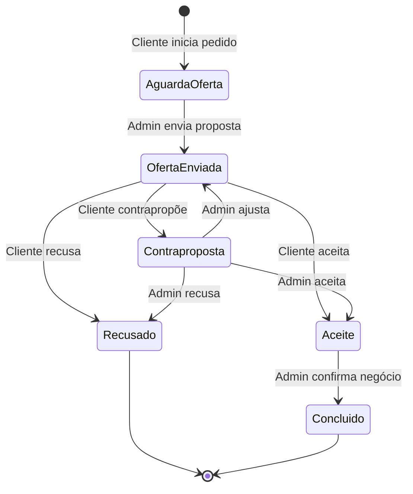

# 💰 Sistema de Negociação

O sistema de negociação permite aos proprietários de veículos comprados no stand iniciar processos de venda ou troca com contrapropostas e mensagens.

## Tipos de Negociação

### Venda
O cliente quer vender o seu veículo ao stand.
- Cliente propõe valor
- Admin faz contraproposta
- Negociação até acordo

### Troca
O cliente quer trocar o seu veículo por outro(s) do stand.
- Cliente seleciona veículos pretendidos
- Sistema calcula diferença de valor
- Admin propõe valores de compensação
- Transferência automática de propriedade

## Fluxo de Negociação



## Estados da Negociação

| Estado | Descrição | Próximas Ações |
|--------|-----------|----------------|
| 🟡 Aguarda Oferta | Pedido criado | Admin faz proposta |
| 🔵 Oferta Enviada | Admin propôs valor | Cliente aceita/recusa/contrapropõe |
| 🟠 Contraproposta | Cliente contrapropôs | Admin aceita/recusa/ajusta |
| 🟢 Aceite | Acordo alcançado | Admin confirma negócio |
| ❌ Recusado | Negociação cancelada | - |
| ✅ Concluído | Negócio finalizado | Transferência executada |

## Cálculo de Valores (Troca)

```
Veículo Cliente:     450.000 €
Veículos Pretendidos: 530.000 € (Ferrari + Lamborghini)
─────────────────────────────────
Diferença Tabela:    +80.000 €
Proposta Admin:       70.000 €
Contraproposta:       60.000 €
Valor Final:          65.000 € (Cliente paga)
```

## Transferência de Propriedade

Quando o negócio é concluído, o sistema executa automaticamente:

### Para VENDA:
```php
// Veículo do cliente volta ao inventário
$db->query(
    "UPDATE vehicles SET buyer_id = NULL, sold_date = NULL, status_id = ? WHERE id = ?",
    [$availableStatusId, $vehicleId]
);
```

### Para TROCA:
```php
// Veículo do cliente volta ao stand
$db->query(
    "UPDATE vehicles SET buyer_id = NULL, sold_date = NULL, status_id = ? WHERE id = ?",
    [$availableStatusId, $clientVehicleId]
);

// Veículos do stand passam para o cliente
foreach ($targetVehicles as $vehicleId) {
    $db->query(
        "UPDATE vehicles SET buyer_id = ?, sold_date = NOW(), status_id = ? WHERE id = ?",
        [$userId, $soldStatusId, $vehicleId]
    );
}
```

## Sistema de Mensagens

A negociação inclui um sistema de mensagens integrado:

```sql
CREATE TABLE negotiation_messages (
    id INT UNSIGNED AUTO_INCREMENT PRIMARY KEY,
    request_id INT UNSIGNED NOT NULL,
    sender_type ENUM('user', 'admin') NOT NULL,
    sender_id INT UNSIGNED NOT NULL,
    message TEXT NULL,
    offer_value DECIMAL(10,2) NULL,
    action ENUM('message', 'offer', 'counter_offer', 'accept', 'reject'),
    created_at TIMESTAMP DEFAULT CURRENT_TIMESTAMP,
    
    FOREIGN KEY (request_id) REFERENCES sell_trade_requests(id)
);
```

## Histórico de Ações

Cada negociação mantém um histórico completo:
- Cliente - Iniciou pedido
- Admin - Oferta 70.000€
- Cliente - Contraproposta 60.000€
- Admin - Aceitou
- Sistema - Negócio concluído

## Notificações

| Evento | Destinatário | Método |
|--------|--------------|--------|
| Novo pedido | Admin | Email + In-app |
| Nova proposta | Cliente | Email + In-app |
| Contraproposta | Admin | Email + In-app |
| Negócio concluído | Ambos | Email |

## Screenshots

### Painel de Negociação (Admin)


### Histórico de Mensagens

