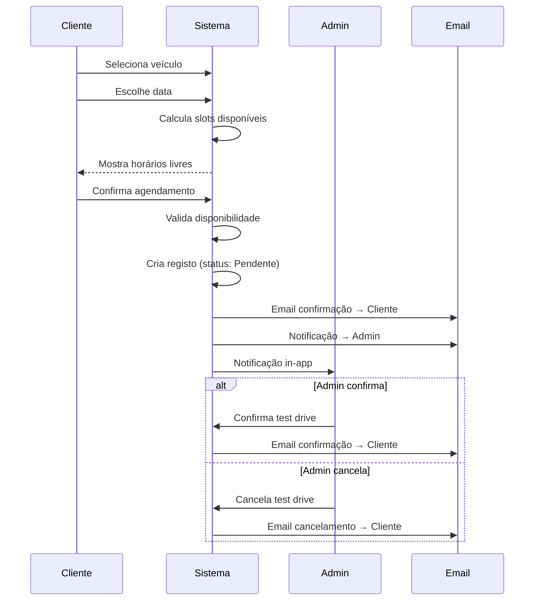

# 📅 Sistema de Test Drives

O sistema de test drives permite aos utilizadores agendar visitas para experimentar veículos, com gestão automática de slots e confirmações.

## Funcionalidades

### Para Clientes
- **Agendamento online**: Calendário interativo
- **Slots dinâmicos**: Disponibilidade em tempo real
- **Confirmação por email**: Detalhes da marcação
- **Gestão de marcações**: Ver, cancelar reservas

### Para Administradores
- **Dashboard**: Visão geral das marcações
- **Estados**: Pendente, Confirmado, Concluído, Cancelado, Não Compareceu
- **Filtros**: Por data, estado, veículo
- **Notificações**: Alertas de novas marcações

## Gestão de Slots

O sistema calcula automaticamente a disponibilidade considerando:
- Horário de funcionamento do stand
- Pausa de almoço
- Duração do test drive (1 hora = 2 slots de 30 min)
- Número máximo de test drives simultâneos

```php
// api/test-drive-slots.php
function getSlotOccupancy($time, $bookedTimes, $maxConcurrent) {
    $slotMinutes = (int)$parts[0] * 60 + (int)$parts[1];
    $occupancy = 0;
    
    foreach ($bookedTimes as $bookedTime => $count) {
        $bookedMinutes = (int)$bookedParts[0] * 60 + (int)$bookedParts[1];
        // Test drive de 1h ocupa 2 slots de 30min
        if ($bookedMinutes === $slotMinutes || 
            $bookedMinutes === $slotMinutes - 30) {
            $occupancy += $count;
        }
    }
    return $occupancy;
}
```

## Fluxo de Agendamento



## Estados do Test Drive

| Estado | Descrição | Ação |
|--------|-----------|------|
| 🟡 Pendente | Aguarda confirmação | Admin confirma/cancela |
| 🟢 Confirmado | Marcação confirmada | Aguarda realização |
| ✅ Concluído | Test drive realizado | Pode deixar review |
| ❌ Cancelado | Cancelado por cliente/admin | - |
| ⚠️ Não Compareceu | Cliente não apareceu | Registado no histórico |

## Configurações

As configurações são geridas na área administrativa:

| Configuração | Descrição | Valor Padrão |
|--------------|-----------|--------------|
| Horário Semana | Segunda a Sexta | 09:00 - 19:00 |
| Horário Sábado | Sábado | 10:00 - 13:00 |
| Pausa Almoço | Intervalo sem marcações | 12:00 - 13:30 |
| Max. Simultâneos | Test drives ao mesmo tempo | 2 |
| Duração | Tempo de cada test drive | 60 minutos |

## Notificações Automáticas

### Email ao Cliente
- Confirmação de agendamento
- Lembrete (24h antes)
- Cancelamento
- Pedido de review (após conclusão)

### Notificação ao Admin
- Nova marcação
- Cancelamento pelo cliente

## Modelo de Dados

```sql
CREATE TABLE test_drives (
    id INT UNSIGNED AUTO_INCREMENT PRIMARY KEY,
    user_id INT UNSIGNED NOT NULL,
    vehicle_id INT UNSIGNED NOT NULL,
    scheduled_date DATE NOT NULL,
    scheduled_time TIME NOT NULL,
    notes TEXT NULL,
    status_id INT UNSIGNED DEFAULT 1,
    review_email_sent TINYINT(1) DEFAULT 0,
    created_at TIMESTAMP DEFAULT CURRENT_TIMESTAMP,
    
    FOREIGN KEY (user_id) REFERENCES users(id),
    FOREIGN KEY (vehicle_id) REFERENCES vehicles(id),
    FOREIGN KEY (status_id) REFERENCES test_drive_status(id)
);
```
