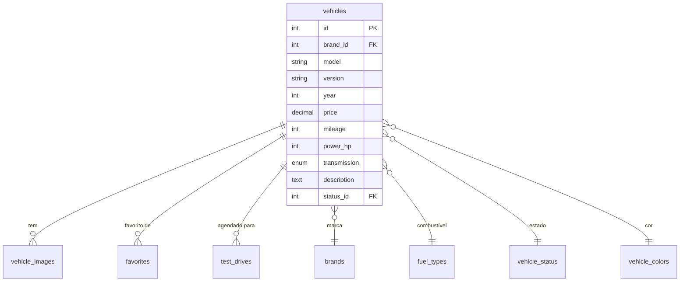

# 🚗 Gestão de Veículos

O módulo de gestão de veículos é o core do sistema BabeStand, permitindo operações CRUD completas com upload seguro de imagens.

## Funcionalidades

### Área Pública
- **Catálogo**: Listagem com paginação e filtros
- **Filtros**: Marca, combustível, preço, ano, quilometragem
- **Pesquisa**: Fulltext search no modelo e descrição
- **Ordenação**: Preço, ano, data de publicação
- **Comparador**: Comparação lado a lado de veículos

### Área Administrativa
- **CRUD Completo**: Criar, ler, atualizar, eliminar
- **Multi-imagens**: Até 20 imagens por veículo
- **Estados**: Disponível, Reservado, Vendido, Em Manutenção
- **Destaque**: Veículos em destaque na homepage

## Modelo de Dados



## Upload de Imagens

O sistema implementa validação em **9 camadas** para uploads:

1. ✅ Verificação de extensão (.jpg, .png, .webp)
2. ✅ Validação MIME type real (`finfo_file()`)
3. ✅ Verificação de magic bytes
4. ✅ Validação de dimensões (máx 1920x1080)
5. ✅ Limite de tamanho (máx 5MB)
6. ✅ Scan de padrões maliciosos (`<?php`, `<script>`)
7. ✅ Regeneração da imagem (remove EXIF e código embebido)
8. ✅ Renomeação com hash único
9. ✅ `.htaccess` bloqueia execução PHP na pasta uploads

```php
// ImageValidator.php - Regeneração segura
public function processAndSave($file, $path, $maxWidth, $maxHeight, $quality) {
    $source = imagecreatefromstring(file_get_contents($file['tmp_name']));
    $dest = imagecreatetruecolor($newWidth, $newHeight);
    imagecopyresampled($dest, $source, 0, 0, 0, 0, $newWidth, $newHeight, $origWidth, $origHeight);
    imagejpeg($dest, $path, $quality);
}
```

## Estados do Veículo

| Estado | Descrição | Visível Público |
|--------|-----------|-----------------|
| Disponível | Pronto para venda | ✅ Sim |
| Reservado | Cliente interessado | ✅ Sim |
| Vendido | Venda concluída | ✅ 7 dias |
| Em Manutenção | Em reparação | ❌ Não |
| Indisponível | Removido temporariamente | ❌ Não |

## Visibilidade Pública

```php
// Filtro de visibilidade - veiculos.php
$where = [
    "s.name != 'Indisponível'",
    "(s.name != 'Vendido' OR 
     (s.name = 'Vendido' AND v.sold_date > DATE_SUB(NOW(), INTERVAL 7 DAY)))"
];
```

## API Endpoints

| Método | Endpoint | Descrição |
|--------|----------|-----------|
| GET | `/veiculos` | Lista pública com filtros |
| GET | `/veiculo?id={id}` | Detalhe do veículo |
| GET | `/admin/veiculos` | Lista administrativa |
| POST | `/admin/veiculos` | Criar veículo |
| PUT | `/admin/veiculos?id={id}` | Atualizar veículo |
| DELETE | `/admin/veiculos?id={id}` | Eliminar veículo |
