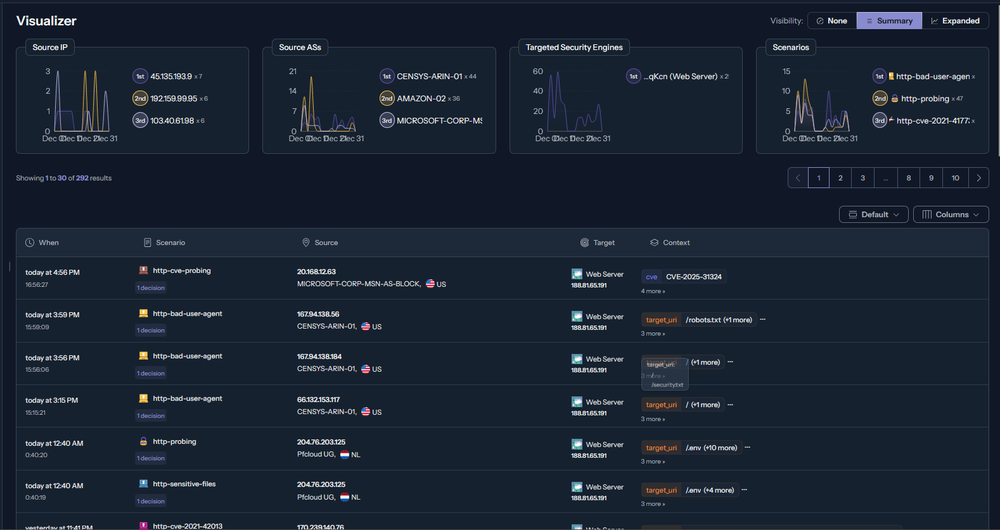

# 🤖 Testes Automatizados

Esta secção documenta os testes automatizados realizados com ferramentas de penetração em ambiente Kali Linux.

## Ferramentas Utilizadas

| Categoria | Ferramenta | Objetivo |
|-----------|------------|----------|
| Reconhecimento | `whatweb` | Identificação de tecnologias |
| Reconhecimento | `nmap` | Scan de portas e serviços |
| Enumeração | `gobuster` | Descoberta de diretórios |
| Enumeração | `ffuf` | Fuzzing de parâmetros |
| Vulnerabilidades | `nikto` | Scan de vulnerabilidades web |
| Vulnerabilidades | `nuclei` | Templates de CVEs conhecidos |
| SQL Injection | `sqlmap` | Deteção e exploração de SQLi |
| XSS | `dalfox` | Deteção automatizada de XSS |
| TLS/SSL | `testssl.sh` | Análise de configuração TLS |

## Resultados do Scan

### Resumo

| Severidade | Vulnerabilidades |
|------------|------------------|
| 🔴 Crítica | 0 |
| 🟠 Alta | 0 |
| 🟡 Média | 1 |
| 🟢 Baixa | 2 |
| **Total** | **3** |

As 3 vulnerabilidades identificadas são **recomendações de configuração**, não riscos exploráveis.

---

## Proteção Cloudflare WAF

Durante os testes automatizados, o Cloudflare WAF bloqueou a maioria dos pedidos maliciosos:

### Estatísticas

| Métrica | Valor |
|---------|-------|
| Total de pedidos | 46.52k |
| Pedidos mitigados | 44.53k (96%) |
| Pedidos ao servidor | 433 (1%) |
| Pedidos em cache | 1.55k (3%) |

### Tipos de Bloqueio

- **Padrões de scanning**: User-agents de ferramentas
- **Rate limiting**: Excesso de requisições/segundo
- **Payloads maliciosos**: Injection nas querystrings


---

## Proteção CrowdSec IDS

O CrowdSec no Web Server (Nginx) registou 292 alertas:

### Cenários Detetados

| Cenário | Descrição | Ocorrências |
|---------|-----------|-------------|
| http-bad-user-agent | Bots maliciosos | 47 |
| http-probing | Scanning | 47 |
| http-cve-probing | Exploits CVE | 15+ |
| http-sensitive-files | Acesso a .env, .git | 10+ |

### CVEs Detetados

- **CVE-2025-31324** - SAP NetWeaver
- **CVE-2021-42013** - Apache Path Traversal

**Nota**: O servidor BabeStand (Apache) registou **0 alertas**, confirmando que a arquitetura de defesa em profundidade funciona.



---

## Testes de DDoS

### HTTP Flood (Layer 7) - GoldenEye

```bash
$ python goldeneye.py https://babestand.fsociety.pt
0 GoldenEye strikes hit. (33 Failed)
0 GoldenEye strikes hit. (33 Failed)
...
Shutting down GoldenEye
```

**Resultado**: ✅ 100% bloqueado pelo Cloudflare

### SYN Flood (Layer 4) - hping3

```bash
$ sudo hping3 -S --flood -V -p 443 babestand.fsociety.pt
HPING babestand.fsociety.pt (eth0 172.67.141.137): S set, 40 headers
--- babestand.fsociety.pt hping statistic ---
4041827 packets transmitted, 0 packets received, 100% packet loss
```

**Resultado**: ✅ 4M+ pacotes absorvidos pelo Cloudflare

**Nota**: IP de destino (172.67.141.137) é da rede Cloudflare, não do servidor real.

---

## Análise TLS - testssl.sh

### Configuração Verificada

| Parâmetro | Valor |
|-----------|-------|
| Protocolo | TLS 1.3 (exclusivo) |
| Cipher Suite | TLS_AES_128_GCM_SHA256 |
| Grupo de Chaves | x25519 |
| Assinatura | RSA-PSS-SHA256 |
| Certificado | Let's Encrypt (R12) |
| HSTS | max-age=31536000 |
| Forward Secrecy | ✅ Suportado |

### Vulnerabilidades TLS

| Vulnerabilidade | Estado |
|-----------------|--------|
| POODLE | ✅ Não vulnerável |
| BEAST | ✅ Não vulnerável |
| CRIME | ✅ Não vulnerável |
| DROWN | ✅ Não vulnerável |
| Heartbleed | ✅ Não vulnerável |
| ROBOT | ✅ Não vulnerável |

---

## Headers de Segurança

Verificação com `curl`:

```bash
$ curl -I https://babestand.fsociety.pt
```

| Header | Valor | Estado |
|--------|-------|--------|
| X-Frame-Options | SAMEORIGIN | ✅ |
| X-Content-Type-Options | nosniff | ✅ |
| X-XSS-Protection | 1; mode=block | ✅ |
| Referrer-Policy | strict-origin-when-cross-origin | ✅ |
| Permissions-Policy | geolocation=(), microphone=(), camera=() | ✅ |
| Content-Security-Policy | default-src 'self'... | ✅ |

---

## Conclusões

1. **Zero vulnerabilidades críticas ou altas**
2. **Cloudflare WAF bloqueia 96% do tráfego malicioso**
3. **CrowdSec complementa com IDS/IPS interno**
4. **TLS 1.3 exclusivo, sem vulnerabilidades conhecidas**
5. **Headers de segurança completos (6/6)**

A arquitetura de **defesa em profundidade** demonstrou ser eficaz:
```
Internet → Cloudflare (96% bloqueado) → CrowdSec → Aplicação (0 alertas)
```
